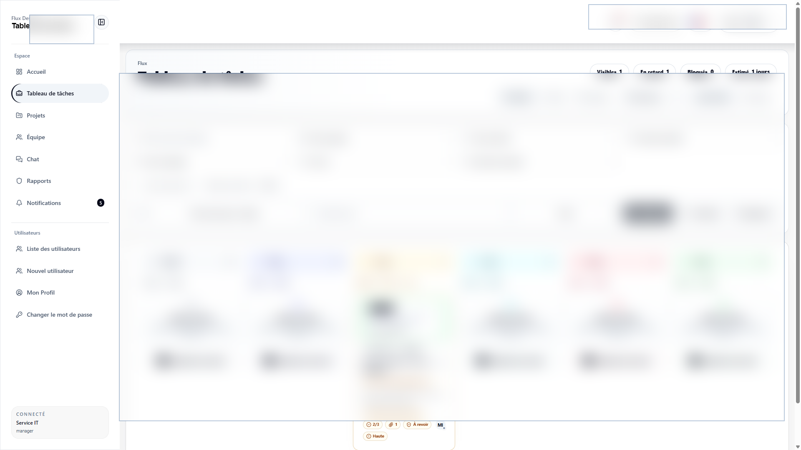

# Design Workflow Frontend

Next.js interface for a design operations platform for projects, tasks, workflow boards, assignments, team workload, comments, activity, attachments, chat, notifications, and realtime collaboration.

This frontend is built around real staff workflows: authenticated navigation, dense dashboards, tables, filters, create/edit/detail pages, forms, actions, settings, notifications, and production data constraints.

## What It Shows

- Product UI work for an internal business system.
- Data-heavy React/Next.js screens with real workflow depth.
- State management with Redux Toolkit and redux-saga.
- Authenticated app structure with NextAuth and API-backed routes.
- Form, table, dashboard, notification, and settings flows built for daily operations.

## Key Capabilities

- Drag-and-drop workflow board for design tasks, review states, project work, and team operations.
- Project list/detail, task detail, my-work, overview, time reports, team, chat, notifications, users, and profile screens.
- React/Next.js UI using Tailwind CSS, Radix UI, dnd-kit, lucide-react, React Day Picker, and chart components.
- Redux Toolkit and redux-saga flows for API state, authenticated screens, task movement, and collaboration views.
- Jest and Testing Library tests, including acceptance coverage for the design workflow shell.

## Stack

- Next.js 16, React 19, TypeScript
- NextAuth, Axios, React Redux
- Redux Toolkit, redux-saga
- Tailwind CSS, Radix UI, dnd-kit, lucide-react, React Day Picker
- Formik, Zod, date-fns
- Jest, Testing Library, ts-jest, Bun

## Related Repository

- Backend API: [Altroo/design_workflow_backend](https://github.com/Altroo/design_workflow_backend)

## Screenshots

Redacted production screenshots. Sensitive names, amounts, dates, and records are blurred.




## Local Setup

Create local-only environment variables for the API base URL, auth settings, websocket endpoints, and public runtime config. Do not commit `.env` files or production credentials.

```bash
bun install
bun run dev
```

Default local port: `3004`.

## Quality Checks

```bash
bun x jest --runInBand --coverage=false
bun run lint
bun run build
```

## Portfolio Note

The repository is public for portfolio review. Screenshots are redacted, and sensitive production values are intentionally hidden.
