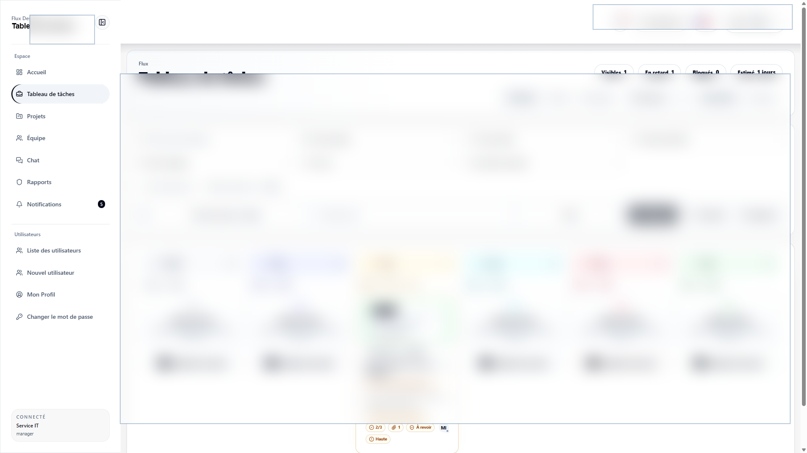
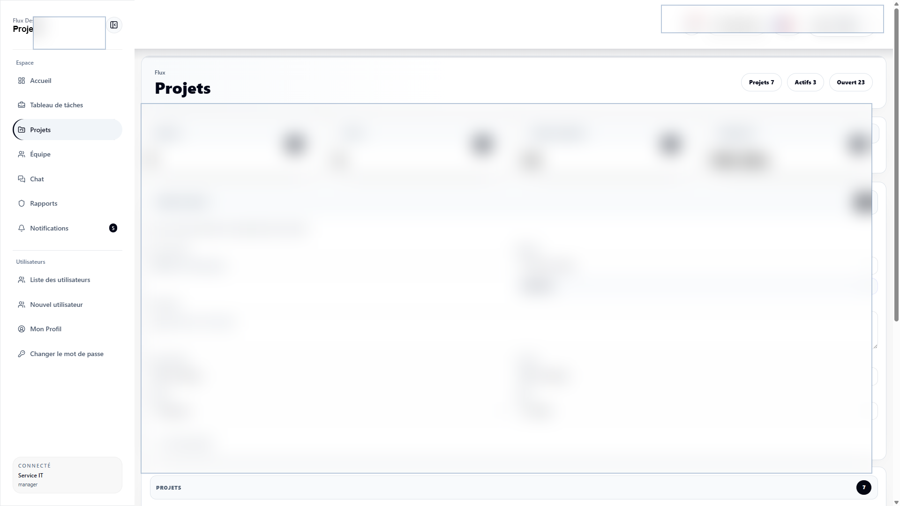

# Design Workflow Frontend

Next.js interface for a design operations platform for projects, tasks, workflow boards, assignments, team workload, comments, activity, attachments, chat, notifications, and realtime collaboration.

This frontend is built around real staff workflows: authenticated navigation, dense dashboards, tables, filters, create/edit/detail pages, forms, actions, settings, notifications, and production data constraints.

## What It Shows

- Product UI work for an internal business system.
- Data-heavy React/Next.js screens with real workflow depth.
- State management with Redux Toolkit and redux-saga.
- Authenticated app structure with NextAuth and API-backed routes.
- Form, table, dashboard, notification, and settings flows built for daily operations.

## Key Capabilities

- Drag-and-drop workflow board for design tasks, review states, project work, and team operations.
- Project list/detail, task detail, my-work, overview, time reports, team, chat, notifications, users, and profile screens.
- React/Next.js UI using Tailwind CSS, Radix UI, dnd-kit, lucide-react, React Day Picker, and chart components.
- Redux Toolkit and redux-saga flows for API state, authenticated screens, task movement, and collaboration views.
- Jest and Testing Library tests, including acceptance coverage for the design workflow shell.

## Stack

- Next.js 16, React 19, TypeScript
- NextAuth, Axios, React Redux
- Redux Toolkit, redux-saga
- Tailwind CSS, Radix UI, dnd-kit, lucide-react, React Day Picker
- Formik, Zod, date-fns
- Jest, Testing Library, ts-jest, Bun

## Related Repository

- Backend API: [Altroo/design_workflow_backend](https://github.com/Altroo/design_workflow_backend)

## Screenshots

Redacted production screenshots. Sensitive names, amounts, dates, and records are blurred.





## Local Setup

Create local-only environment variables for the API base URL, auth settings, websocket endpoints, and public runtime config. Do not commit `.env` files or production credentials.

```bash
bun install
bun run dev
```

Default local port: `3004`.

## Installed app updates

The version in `package.json` identifies the frontend code loaded by the browser.
Use three release numbers (for example `0.2.0`) and bump it for each release.
Redux keeps this bundled version separately from the latest version announced by
`GET /api/ws/maintenance/` and the existing `MAINTENANCE` WebSocket event.
Startup, foreground/online recovery, socket reconnects and the existing visible
workspace reconciliation check the server state.

Release order:

1. Deploy the backend and apply `ws.0002_wsmaintenancestate_version`.
2. Build/deploy the frontend with its new package version and verify its health.
3. In Django admin, edit the current Maintenance row's `version` to that same
   version and save it. This broadcasts the update after the transaction commits.
   Leave the maintenance switch unchanged unless maintenance is actually needed.

Installed Chrome apps show the existing confirmation-dialog design. “Update now”
checks the uncached frontend `/api/app-version` before a full, cache-busted
navigation. It retains the current route and login; it does not erase cookies,
storage, or user preferences. Users can save work and choose Later. An unavailable
release/offline check shows an error without reloading. There is no service worker
or offline app-shell cache to replace, and no reinstall is needed. Old code already
open before this feature first ships needs one normal reload to acquire it.

## Changelog publishing

`/dashboard/changelog` is visible to all signed-in users, directly below
Notifications. Django admin → Changelog stores one dated entry per day with a
French/English title and plain-text changes (one change per line). Entries
also carry a release version, such as `1.0.0`. Older entries without a
recorded release keep this field empty rather than inventing version numbers. Draft and future
entries are hidden; both languages are required to publish. Saving, unpublishing
or deleting an entry refreshes open changelog pages through WebSocket.

Backend migrations `ws.0003` and `ws.0004` create the table and seed 12 curated
Git-history milestones. Seed dates are source-history dates, not deployment-time
claims; commit references are retained in the migration for editorial auditing.
Future notes are entered in admin, not generated from raw commits in the browser.

## Quality Checks

```bash
bun x jest --runInBand --coverage=false
bun run lint
bun run build
```

## Portfolio Note

The repository is public for portfolio review. Screenshots are redacted, and sensitive production values are intentionally hidden.
